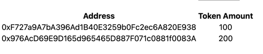

## Airdropping Dapp 
deployed on the Goerli network
see the contract address in: app.config.ts


## Getting Started

First, run the development server:

```bash
npm run dev
# or
yarn dev
```


Upload CSV in the following format

Open [http://localhost:3000](http://localhost:3000) with your browser to see the result.


